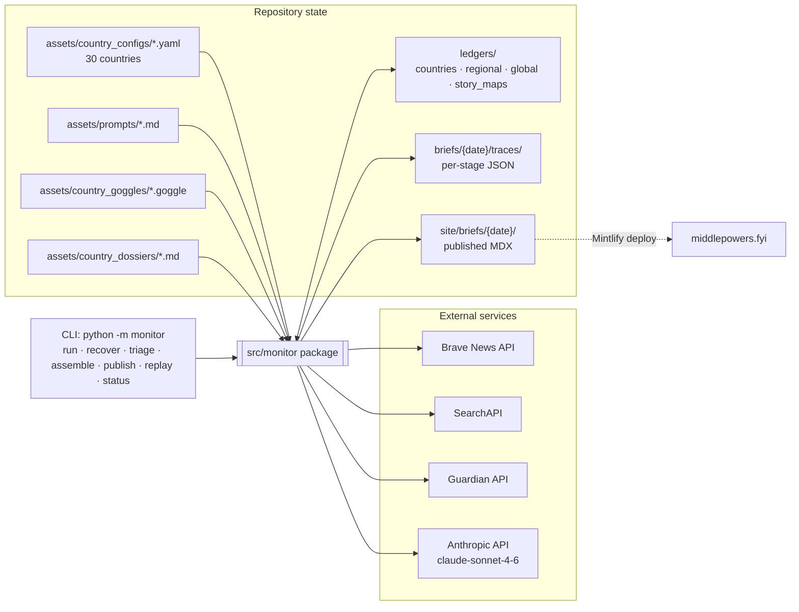
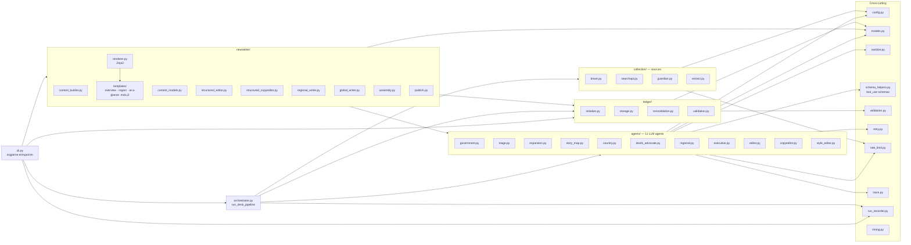

# Middle Powers Monitor — Architecture Diagrams

Source of truth: `src/monitor/` as of 2026-04-21. Tests (`tests/monitor/`) are omitted by request.

---

## 1. System Context

External services, local state, and the CLI surface around the `monitor` package.

---

## 2. Weekly Pipeline

End-to-end flow of `cmd_run`, following `orchestrator.run_desk_pipeline` → regional → executive → newsletter → publishing. Every stage also writes a trace JSON file to `briefs/{date}/traces/`.

```mermaid
flowchart TD
    START(["cmd_run(end_date, country_codes?)"]) --> L2

    subgraph DESK["Desk pipeline — per-country, concurrent"]
        direction TB
        L2["1. Layer 2<br/>government source collection<br/>agents/government.py"]
        DOMAINS["2. Assemble domain lists<br/>assemble_country_domains"]
        TRIAGE["3. Triage scan + depth decision<br/>agents/triage.py"]
        EXPAND["4. Search expansion<br/>agents/expansion.py + collection/brave.py"]
        STORY["5. Story Map clustering<br/>agents/story_map.py"]
        EXTRACT["6. Selective extraction<br/>collection/extract.py"]
        COUNTRY["7. Country Agent — 5-signal analysis<br/>agents/country.py"]
        DA["8. Devils Advocate<br/>agents/devils_advocate.py"]
        APPLY["9. Apply to ledger<br/>ledger/storage.py"]

        L2 --> DOMAINS --> TRIAGE --> EXPAND --> STORY --> EXTRACT --> COUNTRY --> DA --> APPLY
    end

    APPLY --> REGIONAL["10. Regional Synthesis — 6 regions<br/>agents/regional.py"]
    REGIONAL --> EXEC["11. Executive Synthesis<br/>agents/executive.py"]

    EXEC --> BUILD

    subgraph NEWS["Newsletter assembly — 3 edit rounds"]
        direction TB
        BUILD["12. build_all_pages<br/>newsletter/content_builder.py"]

        subgraph R1["Round 1 — country scope"]
            direction LR
            E1["edit_all"] --> C1["copyedit_all"] --> S1["style_edit_all"]
        end

        RW["write_all_regional_essays<br/>regional_writer.py"]

        subgraph R2["Round 2 — regional scope"]
            direction LR
            E2["edit_all"] --> C2["copyedit_all"] --> S2["style_edit_all"]
        end

        GW["write_global_essay<br/>global_writer.py"]

        subgraph R3["Round 3 — executive scope"]
            direction LR
            E3["edit_all"] --> C3["copyedit_all"] --> S3["style_edit_all"]
        end

        BUILD --> E1
        S1 --> RW --> E2
        S2 --> GW --> E3
    end

    S3 --> RENDER

    subgraph PUB["Publishing"]
        direction TB
        RENDER["13. render_pages<br/>Jinja2 templates to MDX<br/>newsletter/renderer.py"]
        PUBLISH["14. publish_brief<br/>write site/briefs/{date}/<br/>newsletter/publish.py"]
        RENDER --> PUBLISH
    end

    PUBLISH --> DONE(["7 MDX pages:<br/>overview + at-a-glance + 5 region pages"])

    REC[["RunRecorder<br/>run_recorder.py"]]
    REC -. "snapshots ledgers,<br/>hashes prompts,<br/>records timings and cost" .-> DESK
    REC -.-> REGIONAL
    REC -.-> EXEC
    REC -.-> NEWS
    REC -.-> PUB
```

Notes:

- `cmd_recover` reuses the same stages scoped to one or more countries. With `--skip-regional` it preserves other countries' prose by reading prior MDX back (`_extract_country_narratives_from_mdx` in `cli.py`).
- `--resume-from` checkpoints between the five top-level stages (`desk`, `regional`, `executive`, `newsletter`, `publishing`) by reloading ledgers/traces from disk.

---

## 3. Package Layout

Modules inside `src/monitor/` and how they compose. Arrows are "imports from / calls into."

---

## 4. Data Flow Summary

| Input | Transforms via | Output |
|---|---|---|
| Country YAMLs + goggles + dossiers | Layer 2 + triage + expansion + extraction | Raw article corpus (in-memory + `briefs/{date}/traces/`) |
| Raw corpus | Story Map → Country Agent → Devil's Advocate | `ledgers/countries/{code}.json` weekly entry |
| Country ledgers | Regional agent (per region) | `ledgers/regional/{region}_{date}.json` |
| Regional reports | Executive agent | `ledgers/global.json` entry |
| All ledgers + story maps | `build_all_pages` → 3 edit rounds → renderer | `site/briefs/{date}/*.mdx` (7 pages) |

---

## Regenerating this document

The diagrams above are hand-maintained. If the pipeline topology changes:

1. Stage list: re-check `cmd_run` in `src/monitor/cli.py` and `run_desk_pipeline` in `src/monitor/orchestrator.py`.
2. Agent list: `ls src/monitor/agents/`.
3. Newsletter ordering: the three `edit_all → copyedit_all → style_edit_all` blocks in `cmd_run` interleaved with `write_all_regional_essays` and `write_global_essay`.
